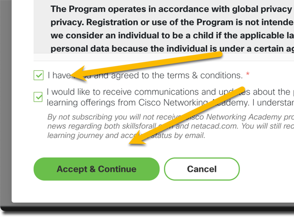

# JavaScript Essentials 1

The following instructions will help you sign up for the JavaScript Essentials 1 free course on Skills for All through the Cisco Network Academy and the [JS Institute](https://js.institute/).

Let's get you signed up for this free course.

---

### Navigate to [https://skillsforall.com](https://skillsforall.com)

---

### Select "continue with Google" and sign in with your school account

---

### Enter the requested information and then click Continue

---

### Confirm your email address and add your name

---

### Check the boxes and then select Accept & Continue

---

### Search for JavaScript Essentials 1 and click Get Started

